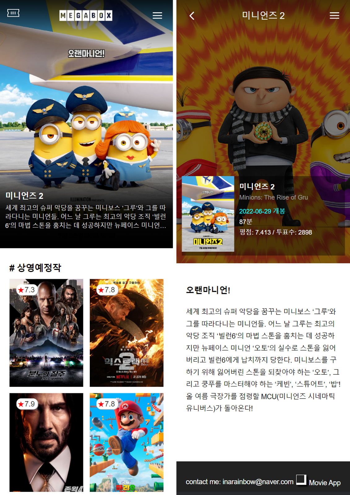

# Movie App

The Movie DB에서 제공되는 영화정보 API를 사용하여 영화 목록을 표시하는 모바일 웹페이지 입니다.

- 최초 랜더링시 20개의 영화정보가 표시되며 하단 '더보기' 버튼 클릭시 20개의 영화정보가 추가로 표시됩니다.
- 메인이미지에는 영화 제목 및 개요 정보를 표시하며, 영화 목록에는 해당 영화의 별점 정보를 나타내도록 하였습니다.
- 헤더, 메인이미지, 영화리스트, 푸터의 컴포넌트로 나누어져 있으며, 함수 방식의 리액트 사용하여 작성되었습니다.

